# AI Workflows — comstruct C-Materials Platform

This document details all AI/LLM-powered pipelines in the platform.

---

## LLM Backend Configuration

The AI service supports three LLM providers, configurable via `LLM_PROVIDER` in `.env`:

| Provider | Models | Use Case |
|----------|--------|----------|
| **OpenAI** | `gpt-4.1-mini` (chat/vision), `text-embedding-3-small` (embeddings), `gpt-4o-mini-transcribe` (audio) | Default cloud provider |
| **Anthropic** | `claude-sonnet-4-5-20250514` | JSON-mode structured outputs |
| **Ollama** | `gemma3:4b` (local) | On-premise, no data leaves infrastructure |

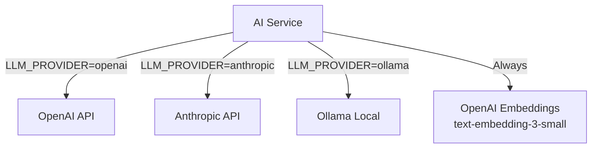

---

## 1. ABC Material Classification

Classifies products into A/B/C material classes to determine which items belong on the C-materials platform.

### Classification Flow

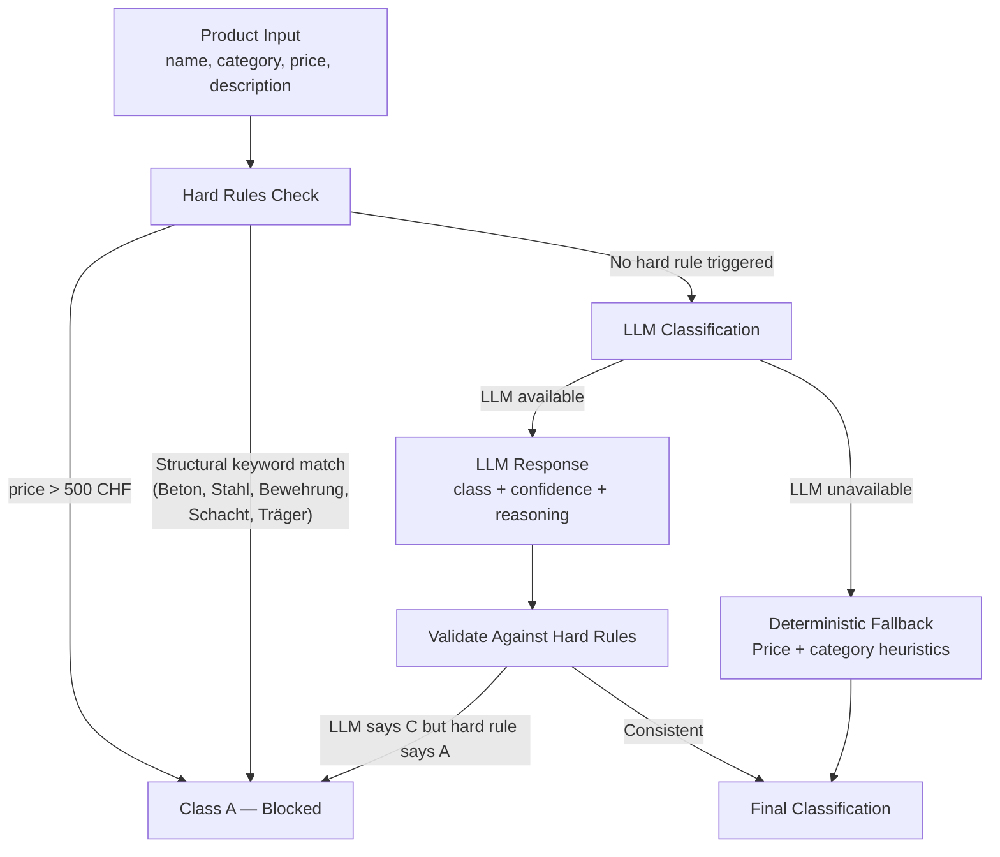

### Hard Rules (Always Enforced)

| Rule | Trigger | Result |
|------|---------|--------|
| Price gate | Unit price > 500 CHF | **A-material** — never C |
| Structural keywords | Name contains: Beton, Stahl, Bewehrung, Schacht, Träger | **A-material** — never C |
| LLM override protection | LLM says C but hard rule says A | Hard rule wins |

### Deterministic Fallback (No LLM)

When the LLM is unavailable, classification uses price + category heuristics:
- PPE, Consumables, Fasteners under 50 CHF → **C**
- Tools under 100 CHF → **C**
- Everything else → **B** (manual review)

### Golden Tests

`services/ai-service/tests/test_classifier_golden.py` locks in known regression cases:
- Structural steel beam → always A
- Work gloves → always C
- LED site lamp → B or C depending on price

---

## 2. Supplier Catalog Ingestion

End-to-end pipeline for importing supplier product catalogs into the platform.

### Ingestion Pipeline

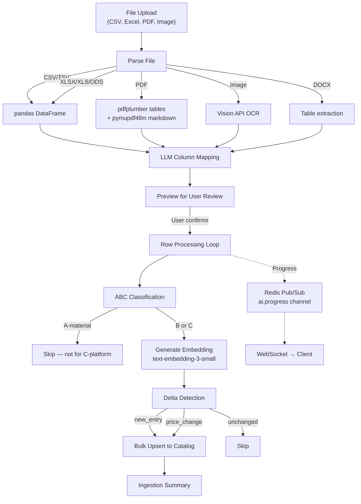

### Column Mapping

The LLM maps raw CSV headers to the canonical schema:

| Canonical Field | Example Raw Headers |
|-----------------|-------------------|
| `name` | Bezeichnung, Artikelname, Description, Produkt |
| `sku` | Artikelnr., SKU, Part Number, Art.Nr. |
| `price` | Preis CHF, Price, Einzelpreis, VK |
| `unit` | Einheit, Unit, Menge, VPE |
| `category` | Kategorie, Category, Warengruppe |

### Delta Detection

Compares incoming rows against existing catalog:

| Delta Type | Condition | Action |
|-----------|-----------|--------|
| `new_entry` | SKU not in catalog | Insert new product |
| `price_change` | SKU exists, price differs | Update price + flag |
| `unchanged` | SKU exists, same data | Skip |
| `skipped` | A-material classification | Do not import |

---

## 3. AI Chat Assistant

Construction-focused conversational AI grounded in the product catalog.

### Chat Flow

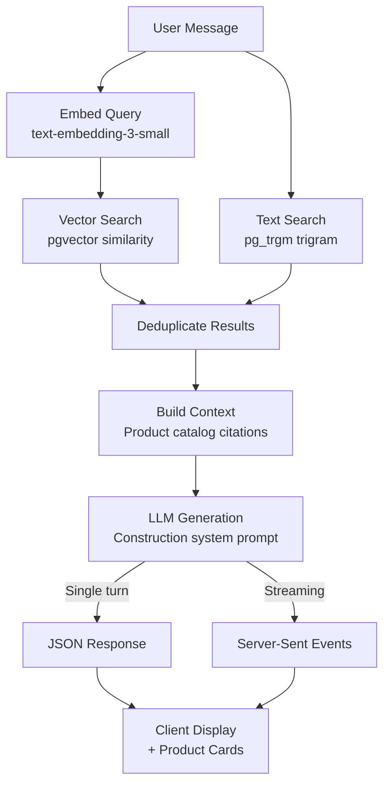

### System Prompt Focus Areas

- SIA norms (Swiss construction standards)
- EN standards (European)
- Swiss construction context (CHF, local suppliers)
- C-material procurement guidance
- Safety and PPE recommendations

### Grounding Strategy

1. User query → embedding via `text-embedding-3-small`
2. Vector similarity search in `catalog.products` (pgvector `<=>` operator)
3. Parallel text search via `pg_trgm` trigram matching
4. Deduplicate and rank results by relevance
5. Inject top products as context into LLM prompt
6. LLM generates response with catalog citations
7. Confidence scoring (0.18–0.94 range)

---

## 4. Product Recommendations

Context-aware product suggestions based on task description and project type.

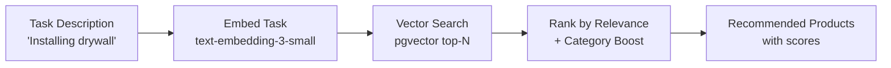

---

## 5. Document Extraction

AI-powered extraction from multiple document formats.

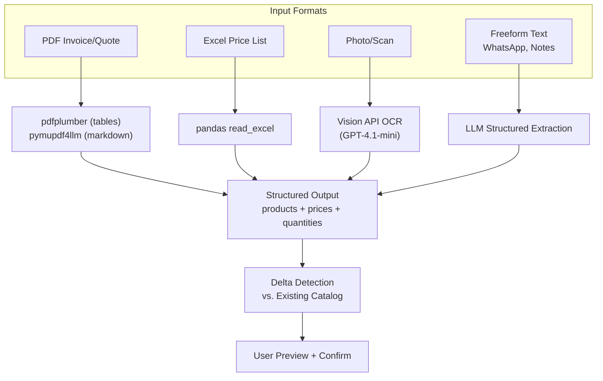

---

## 6. Supplier Scoring

5-factor composite scoring engine for supplier evaluation.

### Scoring Dimensions

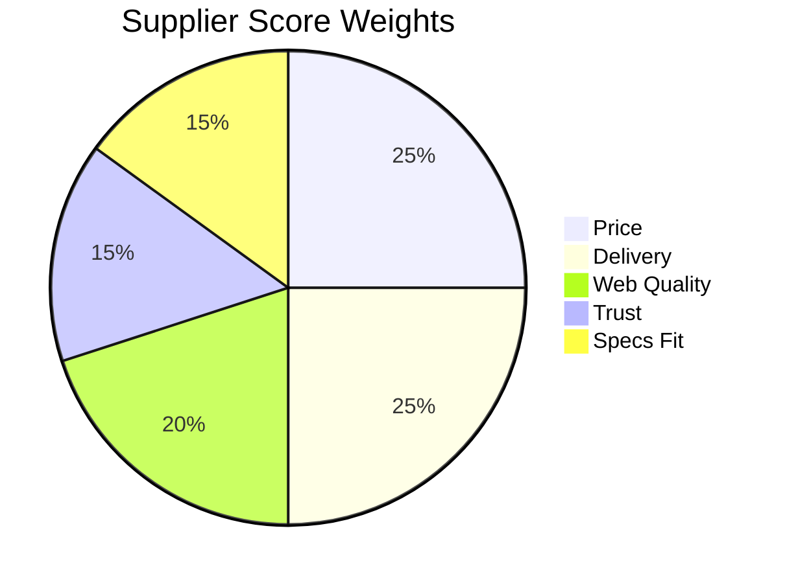

| Dimension | Weight | Data Source |
|-----------|--------|------------|
| **Price** (25%) | Competitive positioning vs. market average | Catalog prices, historical price_history |
| **Delivery** (25%) | Historical performance against orders | order_items delivery timestamps |
| **Trust** (15%) | Interaction history + transaction count | supplier_interactions table |
| **Web Quality** (20%) | Web search reputation + certification signals | Web scraping + search results |
| **Specs Fit** (15%) | Construction relevance + sector signals | Product category analysis |

### Scoring Flow

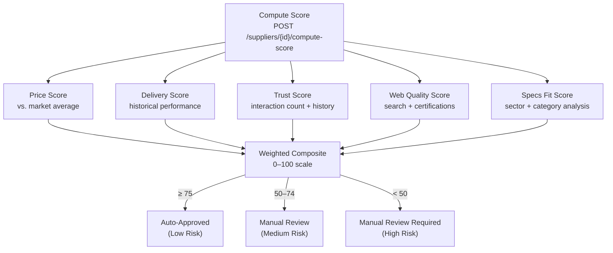

---

## 7. AI Workflows (Automated)

### Auto-Approval Workflow

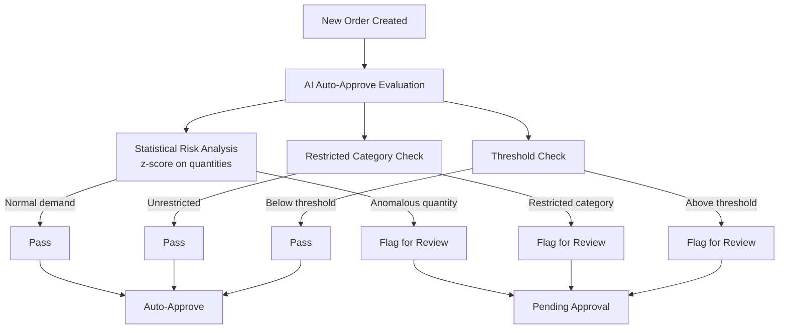

### Price Analysis Workflow

Compares current order prices against historical data to detect anomalies:
- Flags items priced significantly above historical average
- Identifies supplier price drift over time
- Suggests alternative suppliers with better pricing

### Reorder Check Workflow

Predicts material stock depletion based on historical consumption:
- Calculates average consumption rate per material per project
- Estimates days until depletion
- Suggests reorder quantities and timing

### Compliance Check Workflow

Validates orders against budgets and regulations:
- Budget remaining vs. order total
- Regulatory compliance (restricted materials)
- Project-level spending limits

---

## 8. Voice & Image Ordering (Mobile)

### Voice Order Pipeline

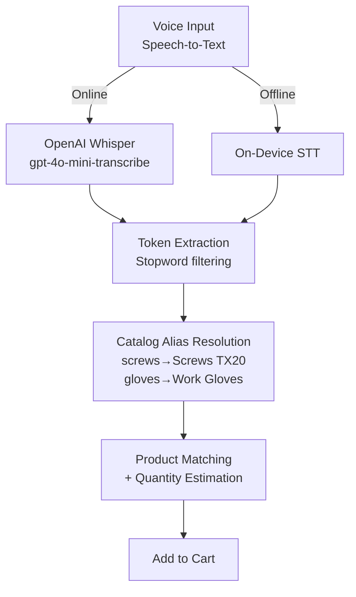

### Image Order Pipeline

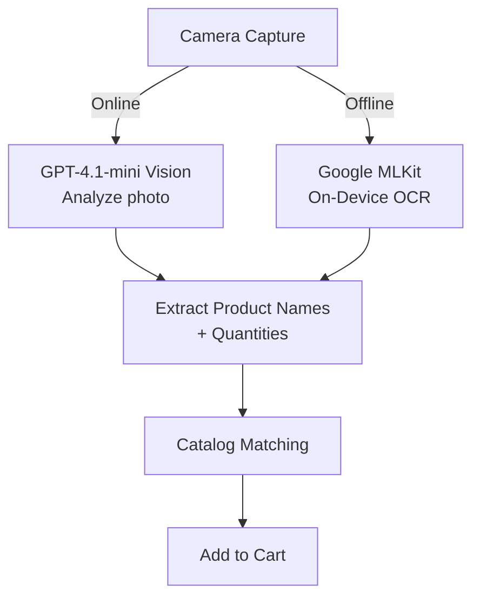

---

## AI Governance

- All LLM responses are **suggestions only** — never auto-checkout. User explicitly confirms
- ABC classifier enforces hard rules that LLM cannot override
- Deterministic fallback ensures platform works without LLM connectivity
- Golden tests prevent silent prompt drift
- LLM sees only product names/categories/prices — never user PII or project addresses
- Local Ollama option ensures zero data leaves infrastructure
