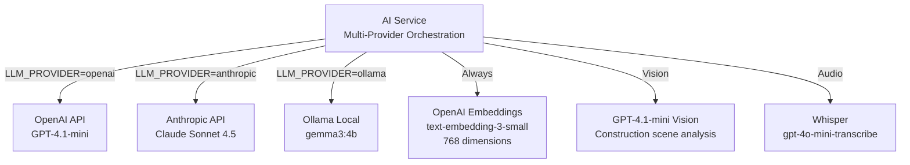
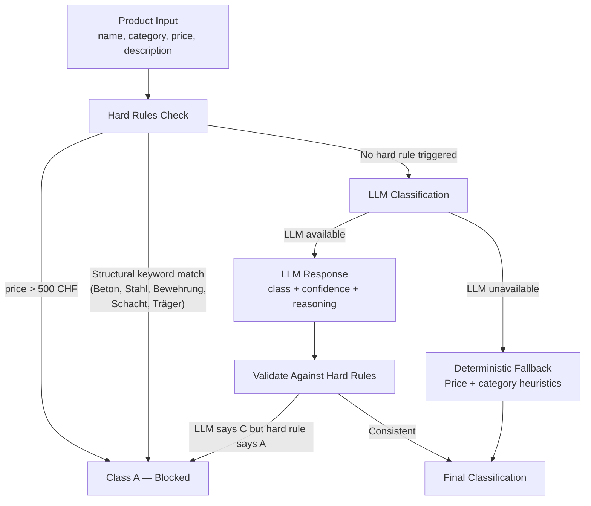
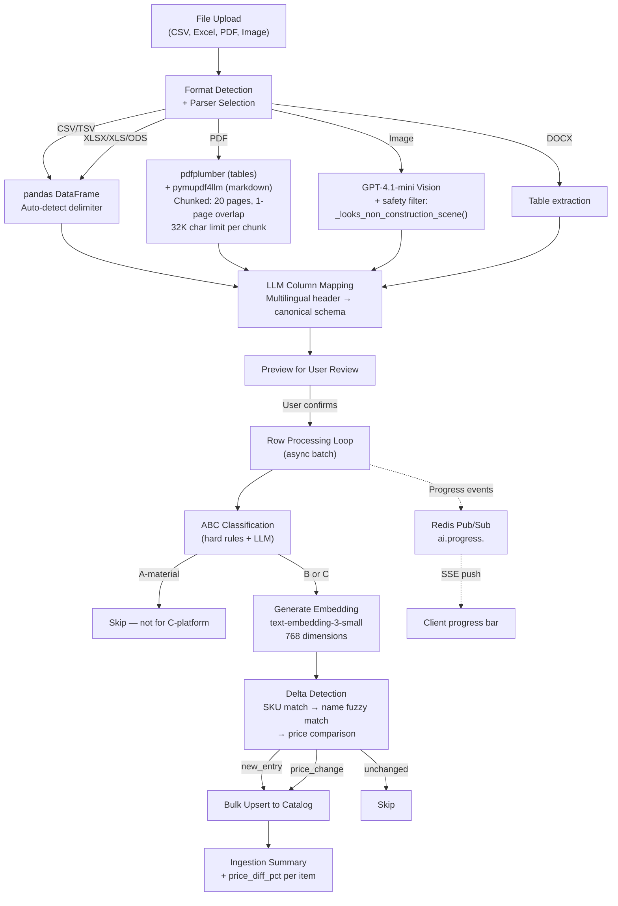
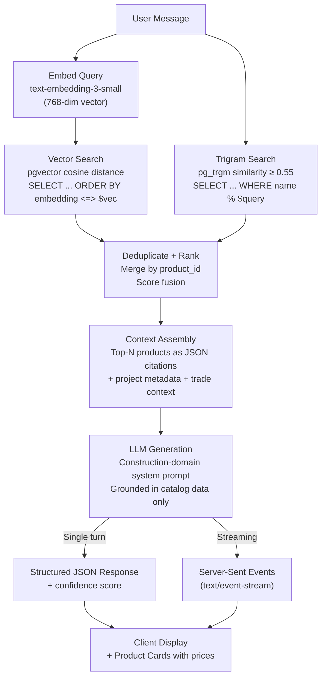
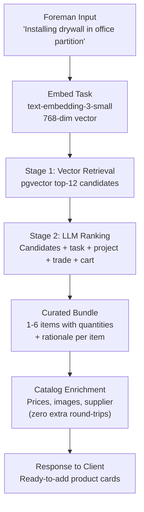
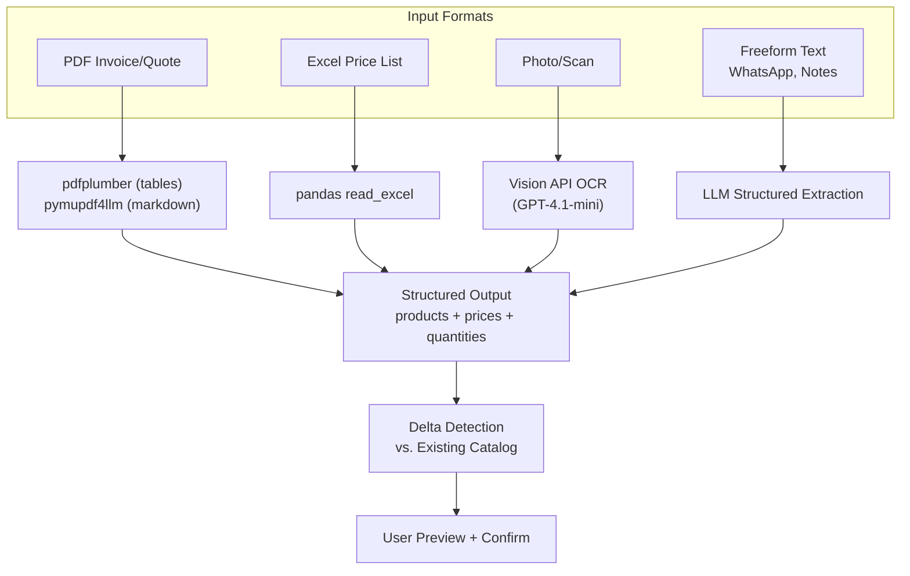
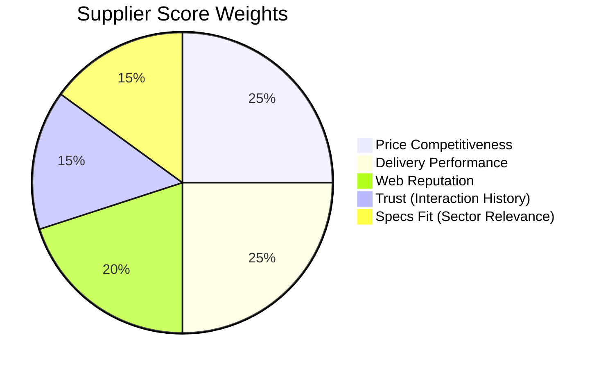
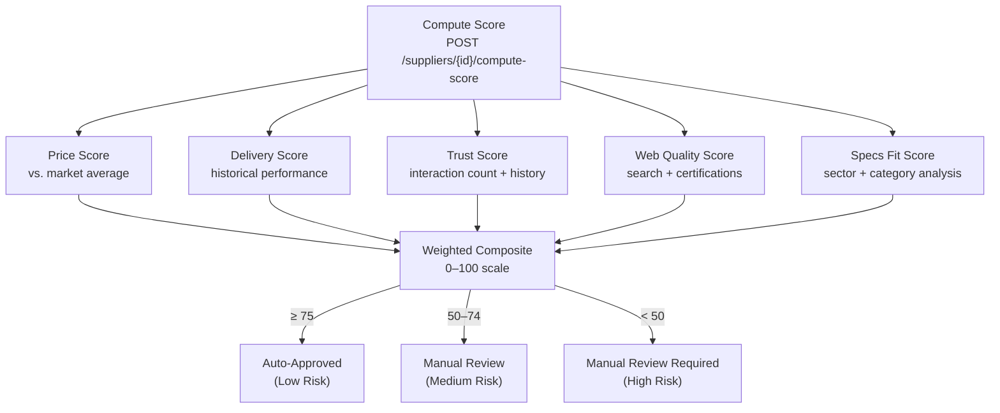
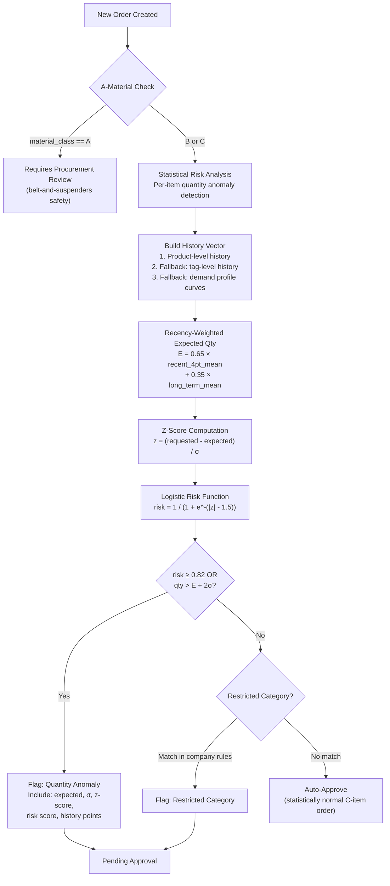
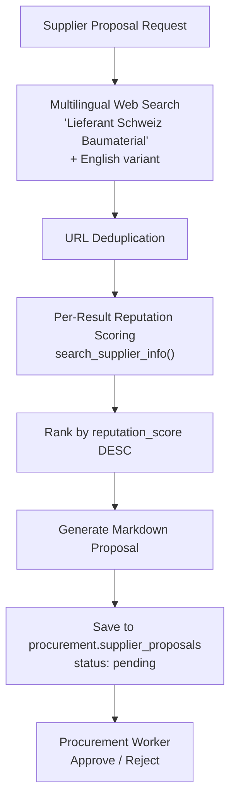

# AI Workflows — comstruct C-Materials Platform

This document details all AI/ML-powered pipelines in the platform: multi-provider LLM orchestration, Retrieval-Augmented Generation (RAG), statistical anomaly detection, composite supplier scoring, and event-driven workflow automation.

---

## LLM Backend Configuration

The AI service implements a **multi-provider LLM abstraction layer** with automatic failover, configurable via `LLM_PROVIDER`:

| Provider | Models | Use Case |
|----------|--------|----------|
| **OpenAI** | `gpt-4.1-mini` (chat/vision), `text-embedding-3-small` (768-dim embeddings), `gpt-4o-mini-transcribe` (audio) | Default cloud provider |
| **Anthropic** | `claude-sonnet-4-5-20250514` | JSON-mode structured outputs |
| **Ollama** | `gemma3:4b` (local) | On-premise, zero data egress |



**Key design**: The embedding pipeline is decoupled from the chat provider — embeddings always use `text-embedding-3-small` (768 dimensions) regardless of which LLM is active, ensuring consistent vector similarity search across provider switches.

---

## 1. ABC Material Classification

Classifies products into A/B/C material classes to determine which items belong on the C-materials platform.

### Classification Flow



### Hard Rules (Always Enforced)

| Rule | Trigger | Result |
|------|---------|--------|
| Price gate | Unit price > 500 CHF | **A-material** — never C |
| Structural keywords | Name contains: Beton, Stahl, Bewehrung, Schacht, Träger | **A-material** — never C |
| LLM override protection | LLM says C but hard rule says A | Hard rule wins |

### Deterministic Fallback (No LLM)

When the LLM is unavailable, classification uses price + category heuristics:
- PPE, Consumables, Fasteners under 50 CHF → **C**
- Tools under 100 CHF → **C**
- Everything else → **B** (manual review)

This **graceful degradation** ensures the platform is never blocked by LLM downtime.

### Prompt Drift Prevention (Golden Tests)

`services/ai-service/tests/test_classifier_golden.py` implements **regression-locked classification** — golden test cases that pin known outputs to prevent silent prompt drift:
- Structural steel beam → always A (safety-critical, never misclassified)
- Work gloves at 12 CHF → always C
- LED site lamp → B or C depending on price threshold

These run in CI and block any prompt changes that would shift classification for known products.

---

## 2. Supplier Catalog Ingestion

End-to-end pipeline for importing supplier product catalogs into the platform.

### Ingestion Pipeline — Multi-Modal Document Intelligence



**PDF Processing Strategy:**
- `pdfplumber` extracts structured tables (price lists, BOMs)
- `pymupdf4llm` converts to markdown for unstructured content
- Documents chunked at 20-page boundaries with 1-page overlap and 32K character cap per chunk
- This prevents token limit issues while maintaining cross-page context

### Column Mapping

The LLM maps raw CSV headers to the canonical schema:

| Canonical Field | Example Raw Headers |
|-----------------|-------------------|
| `name` | Bezeichnung, Artikelname, Description, Produkt |
| `sku` | Artikelnr., SKU, Part Number, Art.Nr. |
| `price` | Preis CHF, Price, Einzelpreis, VK |
| `unit` | Einheit, Unit, Menge, VPE |
| `category` | Kategorie, Category, Warengruppe |

### Delta Detection Pipeline

Compares incoming rows against existing catalog with a **multi-stage matching strategy**:

1. **Exact match**: Supplier ID + SKU (fastest, most reliable)
2. **Fuzzy match**: Normalised product name within same supplier (`re.sub(r"[^a-z0-9]+", "", name.lower())`)
3. **Cross-supplier match**: Name similarity across all suppliers (catch rebrands)

| Delta Type | Condition | Action |
|-----------|-----------|--------|
| `new_entry` | No matching product found | Insert new product |
| `price_change` | SKU exists, price differs | Update price + compute `price_diff_pct` |
| `unchanged` | SKU exists, same data | Skip |
| `skipped` | A-material classification | Do not import |

**Swiss price normalisation**: handles `1'234.50` (Swiss) and `1.234,50` (German) formats via dedicated `_parse_price()` with CHF/EUR stripping.

---

## 3. AI Chat Assistant

Construction-focused conversational AI grounded in the product catalog.

### RAG (Retrieval-Augmented Generation) Pipeline



### Hybrid Retrieval Strategy (Vector + Lexical)

The chat assistant implements a **hybrid search** pattern combining two complementary retrieval methods:

| Method | Implementation | Strength |
|--------|---------------|----------|
| **Semantic (vector)** | pgvector `<=>` cosine distance on 768-dim embeddings | Understands meaning — "PPE for welding" finds goggles |
| **Lexical (trigram)** | PostgreSQL `pg_trgm` with threshold 0.55 | Exact matches — SKU codes, brand names, Swiss-German terms |

Results are merged by `product_id`, deduplicated, and ranked by combined relevance score before injection into the LLM context window.

### System Prompt — Domain Specialisation

The system prompt is **construction-domain specialised** with focus areas:
- SIA norms (Swiss construction standards)
- EN standards (European harmonised norms)
- Swiss construction context (CHF, local suppliers, Bauherr/Bauleitung roles)
- C-material procurement guidance
- Safety and PPE recommendations per trade

### Grounding & Confidence

1. User query → 768-dim embedding via `text-embedding-3-small`
2. Parallel execution: vector similarity search + trigram text search
3. Score fusion + deduplication → top-N catalog products
4. Context assembly: products as structured JSON + project/trade metadata
5. LLM generates response constrained to catalog citations only
6. **Confidence scoring**: grounded materials → `max(confidence, 0.6)`; ungrounded → `min(confidence, 0.25)` — ensures unverified suggestions are visually flagged
7. **Safety filter**: `_looks_non_construction_scene()` detects non-construction images (laptop, monitor, desk) and rejects them

---

## 4. Task-Based Recommendations (Smart Add)

Context-aware product suggestions using a **two-stage retrieval + LLM ranking** pipeline:



**Key design choices:**
- LLM picks from **supplied candidates only** — never invents product IDs
- Quantities are task-proportional (e.g., drywall → screws ×200, not ×10)
- Swiss-German default for construction sites (SIA norms)
- Cart context injected to avoid duplicate recommendations
- Single round-trip: enrichment happens server-side before response

---

## 5. Document Extraction

AI-powered extraction from multiple document formats.



---

## 6. Supplier Scoring

5-factor composite scoring engine for supplier evaluation.

### Scoring Dimensions — Multi-Signal Composite



| Dimension | Weight | Algorithm | Data Source |
|-----------|--------|-----------|------------|
| **Price** (25%) | Linear interpolation: 100 at 30% below market, 50 at parity, 0 at 50% above. Formula: `100 - (avg_ratio - 0.7) × 166.67` | 90-day rolling `procurement.price_history` vs. market average |
| **Delivery** (25%) | Weighted rating: `Σ(rating × count) / total × 20`. Scale: 0–100 | `procurement.supplier_interactions` (type=order) |
| **Trust** (15%) | `80 - dispute_rate × 100 + experience_bonus`. Experience bonus: `min(20, total_interactions × 2)` | `procurement.supplier_interactions` (all types) |
| **Web Quality** (20%) | `reputation_score` from web search cache, capped 0–100 | `procurement.web_search_cache` (latest search) |
| **Specs Fit** (15%) | Evidence-based NLP: +20 construction-sector tokens, +10 Swiss market, +10 B2B signals, +10 certifications (ISO/CE/EN 1090), −15 negative reliability signals. AI-refined when web data available | Web scrape text + LLM assessment |

### Scoring Flow



---

## 7. AI Workflows (Automated)

### Statistical Anomaly Detection (Approval Engine)

The approval engine is **statistics-first** — statistical demand modelling is the primary decision-maker for C-materials, with static rules as safety guardrails only.



**Mathematical Model:**

| Parameter | Value | Formula |
|-----------|-------|---------|
| Expected quantity | Recency-weighted | $E = 0.65 \times \bar{x}_{\text{recent\_4}} + 0.35 \times \bar{x}_{\text{all}}$ |
| Z-score | Standard | $z = \frac{q_{\text{requested}} - E}{\sigma}$ |
| Logistic risk | Sigmoid centered at 1.5 | $\text{risk} = \frac{1}{1 + e^{-(|z| - 1.5)}}$ |
| Upper bound | 2σ envelope | $\text{upper} = E + 2\sigma$ |
| Anomaly threshold | Risk ≥ 0.82 | Configurable via `ORDER_LOGISTIC_RISK_THRESHOLD` |
| Min history points | 4 | Falls back to tag-level or demand profiles |

**Product Tag Derivation** — hierarchical fallback:
1. Explicit taxonomy: `taxonomy_code` → `ai_tag` → `canonical_tag` → `product_family`
2. NLP extraction: keyword matching across 10 categories (brushes, hammers, gloves, masks, screws, sealants, tapes, drill-bits, batteries, cleaners) with bilingual DE/EN keywords
3. Category fallback: last token of product category string

**Demand Profile Curves** — when no historical data exists, the system uses empirically-derived consumption curves per product tag (e.g., screws: `[120, 180, 220, 260, 300, 340, 390, 430, 500]`, gloves: `[12, 20, 24, 36, 48, 60, 72, 84]`).

### Price Analysis Workflow

Compares current order prices against historical data:
- Assessment: `"high"` if price > 110% of historical average, `"low"` if < 90%
- Fallback: calculates avg/low/high from available data when AI unavailable
- Identifies supplier price drift over time

### Reorder Suggestion Workflow

Predicts material stock depletion using burn-down modelling:
- Formula: `days_until_depleted = current_stock / daily_usage_rate`
- Urgency classification: ≤3 days → `"immediate"`, ≤7 → `"soon"`, ≤14 → `"planned"`
- Suggests reorder quantities based on historical consumption velocity

---

## 8. Voice & Image Ordering (Mobile) — Edge AI

### Voice Order Pipeline

```mermaid
flowchart TD
    VOICE[\"Voice Input\nForeman on construction site\"]
    VOICE -->|Online| WHISPER[\"OpenAI Whisper\ngpt-4o-mini-transcribe\"]
    VOICE -->|Offline| LOCAL_STT[\"On-Device STT\nFlutter speech_to_text plugin\"]

    WHISPER --> TOKENS[\"Token Extraction\nStopword filtering\n+ Swiss-German normalisation\"]
    LOCAL_STT --> TOKENS

    TOKENS --> ALIAS[\"Alias Resolution Engine\n13 product groups\n× bilingual DE/EN variants\nScoring: +3 per token, +2 per alias\"]
    ALIAS --> MATCH[\"Catalog Matching\n+ Quantity Estimation\"]
    MATCH --> CART[Add to Cart]
```

**Alias Matching Engine** — handles construction-site speech where products are referred to by informal names:
- 13 product alias groups with multilingual variants (German/English)
- Fuzzy scoring: `+3` per matching token, `+2` per matching alias group
- Handles: \"Schrauben\" → Screws TX20, \"Handschuhe\" → Work Gloves, \"Bohrer\" → SDS Drill Bits

### Image Order Pipeline

```mermaid
flowchart TD
    PHOTO[Camera Capture]
    PHOTO --> SAFETY{\"Safety Filter\n_looks_non_construction_scene()\"}
    SAFETY -->|\"Non-construction\n(laptop, desk, etc.)\"| REJECT[\"Rejected\nNot a construction scene\"]
    SAFETY -->|Construction| ROUTE{Online?}

    ROUTE -->|Online| VISION[\"GPT-4.1-mini Vision\nConstruction-aware extraction\"]
    ROUTE -->|Offline| MLKIT[\"Google ML Kit\nOn-Device OCR\"]

    VISION --> EXTRACT[\"Extract Product Names\n+ Quantities + Brands\"]
    MLKIT --> EXTRACT

    EXTRACT --> MATCH[Catalog Matching]
    MATCH --> CART[Add to Cart]
```

### On-Device AI (Edge Inference)

The mobile app runs **Gemma 3 (4B parameters)** directly on-device via Android MethodChannel:
- Zero-latency classification and product lookup on construction sites with no connectivity
- Model loaded at app startup, inference via Android native layer
- Complements cloud LLM — same ABC classification logic, local execution

### Offline-First Sync Architecture

```mermaid
flowchart TD
    ACTION[\"User Action\n(add to cart, submit order)\"]
    ACTION --> QUEUE[\"Hive Persistent Queue\n+ Idempotency Keys\"]
    QUEUE --> CONN{\"Connectivity Check\nconnectivity_plus plugin\"}
    CONN -->|Offline| WAIT[\"Queue Grows\nAll actions persisted locally\"]
    CONN -->|Online| SYNC[\"FIFO Sync\nProcess queue in order\"]
    SYNC --> DEDUP[\"Server-Side Dedup\nIdempotency key → skip if seen\"]
    DEDUP --> CONFIRM[\"Sync Confirmation\n+ Local state update\"]
    WAIT -.->|\"Connectivity restored\"| SYNC
```

---\n\n---

## 8.5. Real-Time Streaming & Event Architecture

### Server-Sent Events (SSE) Streaming

LLM responses stream token-by-token to the client via SSE:

```
Content-Type: text/event-stream

data: {"token": "For", "done": false}
data: {"token": " drywall", "done": false}
data: {"token": " installation", "done": false}
...
data: {"token": "", "done": true, "products": [...]}
```

Implementation: LangChain `llm.astream()` or Ollama HTTP streaming → `StreamingResponse` with `text/event-stream` content type. Enables real-time typing effect in the UI.

### Event-Driven Pub/Sub Channels

| Channel Pattern | Purpose | Publisher | Subscriber |
|-----------------|---------|-----------|------------|
| `ai.progress.<job_id>` | Document extraction progress | AI Service | Web/Mobile clients |
| `order.status.<order_id>` | Order state changes | Order Service | Notification Service |
| `order.status` | Global order feed | Order Service | Dashboard |
| `price.alert.<company_id>` | Price anomaly alerts | AI Service | Notification Service |

### Atomic Cart Operations (Redis Lua)

Cart state is managed via Redis with **Lua script atomicity** — read-modify-write in a single atomic operation to prevent race conditions in concurrent multi-device ordering:

```lua
-- Atomic cart update (simplified)
local cart = redis.call('GET', KEYS[1])
-- modify cart...
redis.call('SETEX', KEYS[1], 604800, new_cart)  -- 7-day TTL
```

---

## 9. Procurement Constraint Detection

Regex-based NLP extraction from supplier documents:

| Pattern | Detection | Output |
|---------|-----------|--------|
| "must be purchased from", "exclusively from", "only from" | **Mandatory supplier** | `source_locked=True` |
| "framework contract", "preferred supplier" | **Preferred supplier** | `contract_binding="preferred_supplier"` |

Extracts supplier name from regex capture groups and normalises it for matching against the supplier registry.

---

## 10. Supplier Proposal Pipeline

Full automated supplier discovery and evaluation:



---

## AI Governance

| Principle | Implementation |
|-----------|---------------|
| **Human-in-the-loop** | All LLM responses are suggestions only — never auto-checkout. User explicitly confirms every action |
| **Hard rule supremacy** | ABC classifier enforces price > 500 CHF and structural keywords → always A-material, regardless of LLM output |
| **Graceful degradation** | Deterministic fallback ensures platform works without LLM connectivity |
| **Prompt drift prevention** | Golden test suite locks regression cases in CI |
| **Data minimisation at LLM boundary** | LLM sees only product names/categories/prices — never user PII, project addresses, or supplier contact details |
| **Data sovereignty** | Local Ollama option ensures zero data egress from infrastructure |
| **Confidence calibration** | Grounded results get boosted confidence (≥0.6); ungrounded capped at 0.25 — prevents hallucinated recommendations from appearing confident |
| **Construction safety filter** | Vision API rejects non-construction scenes before processing |
