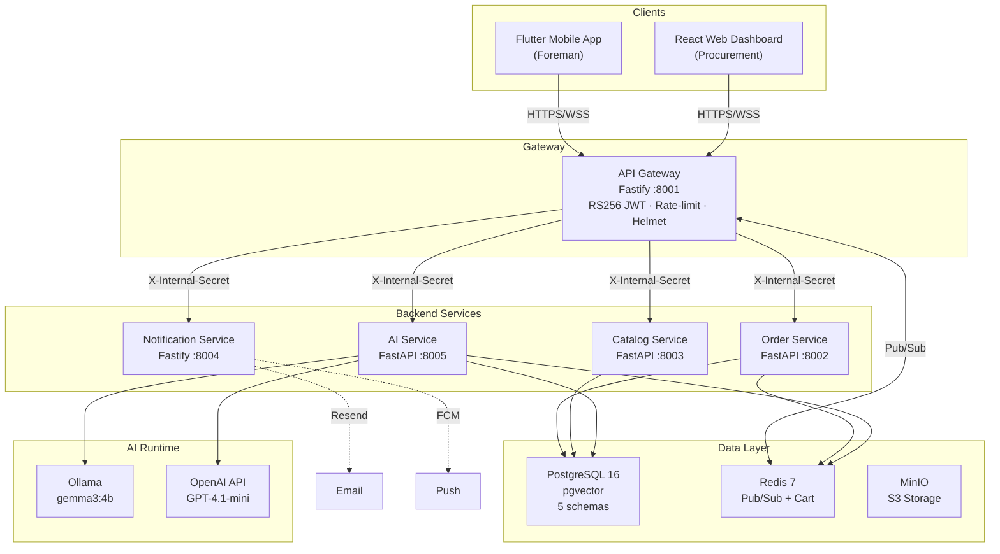
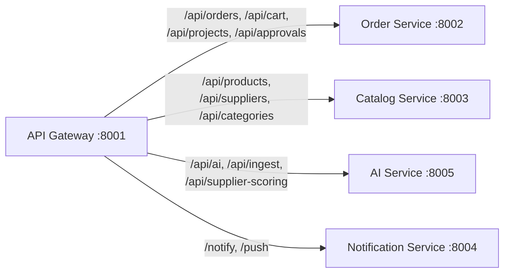
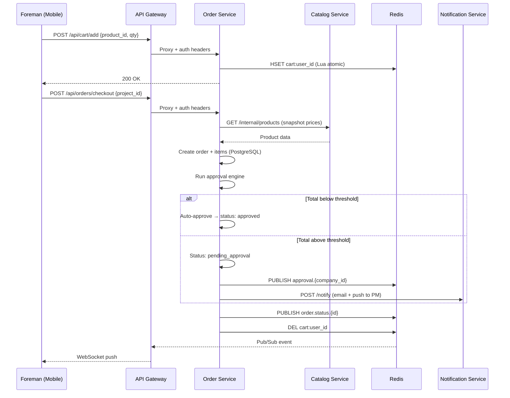
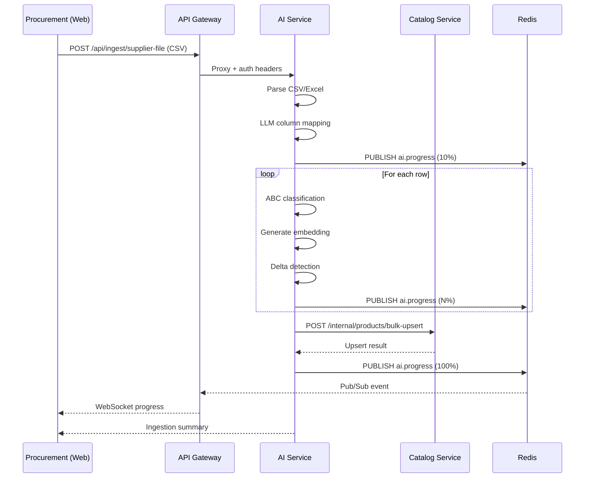
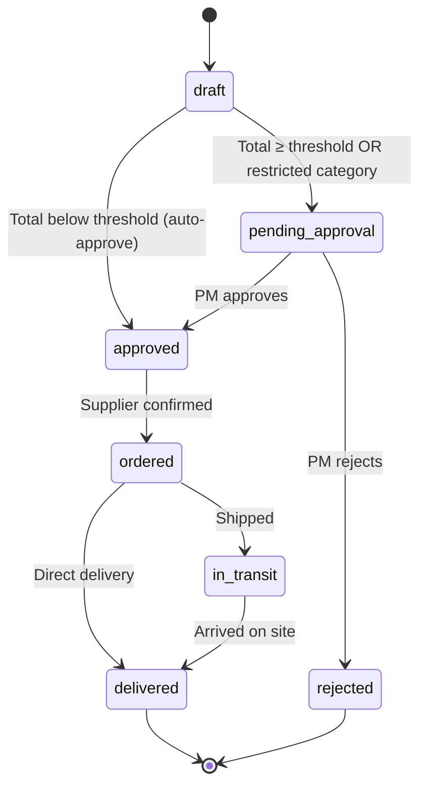
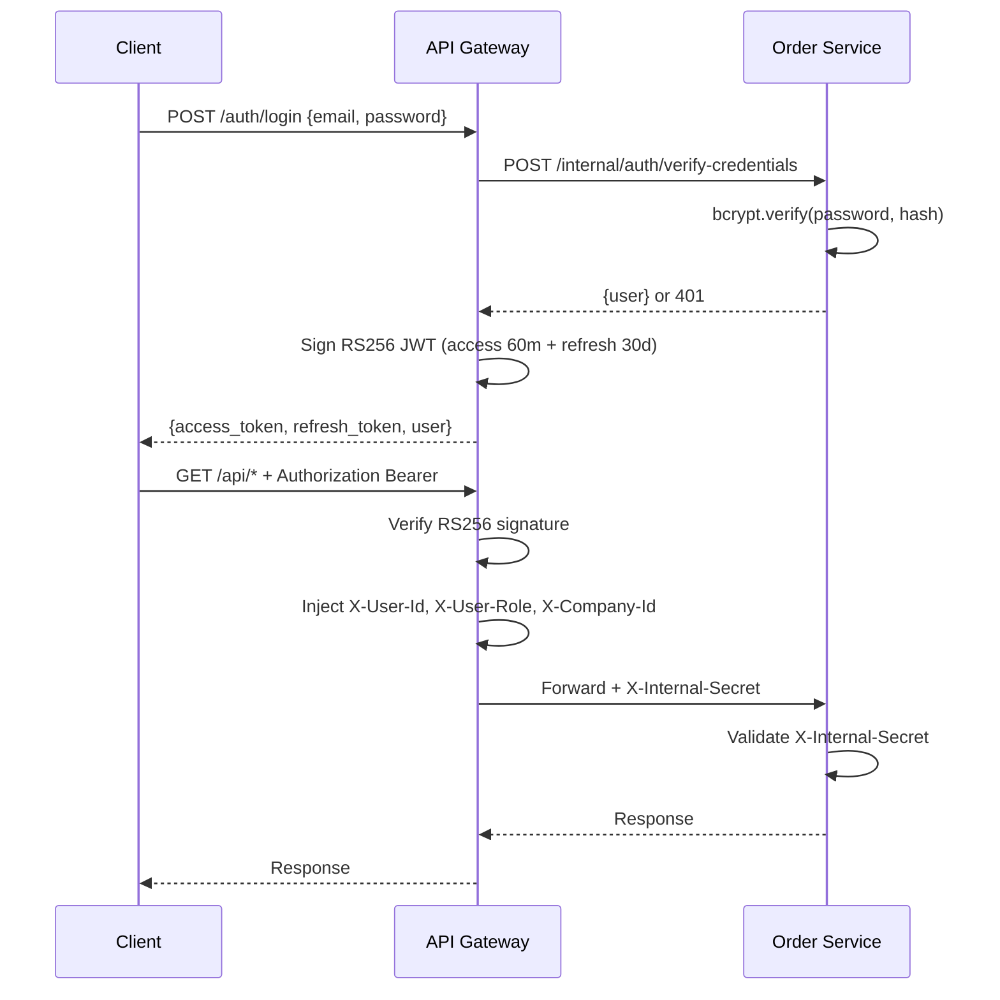
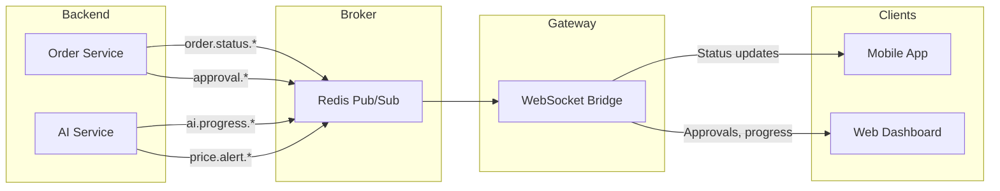
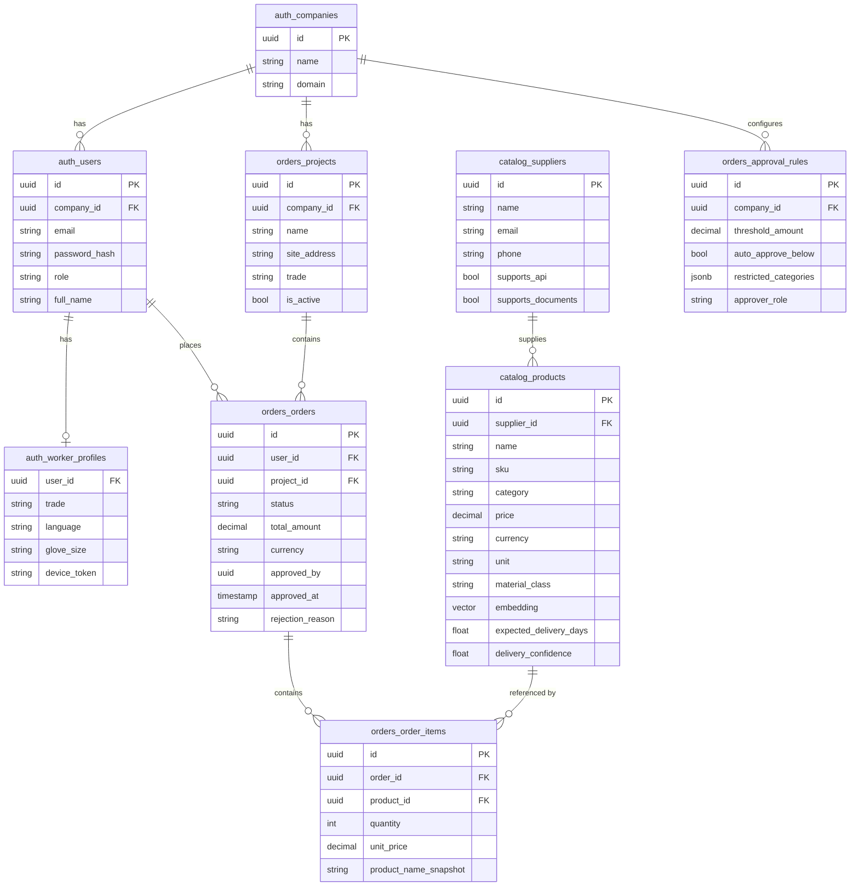
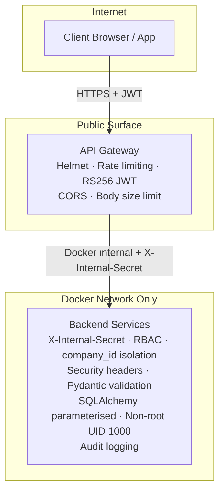
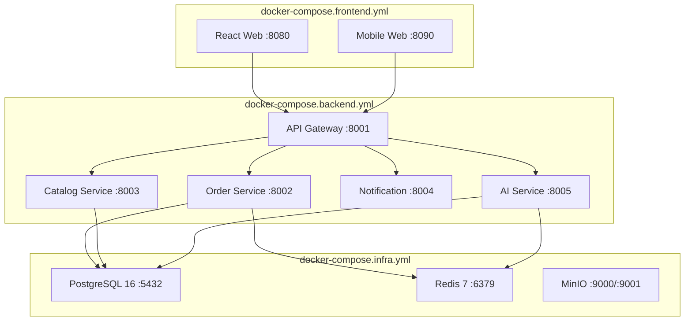

# Architecture — comstruct C-Materials Platform

## System Overview

The platform follows a **microservices architecture** with six services communicating via REST (internal) and WebSocket (client real-time updates), all behind a single API gateway. Data is stored in PostgreSQL 16 with pgvector, Redis for caching/pub-sub, and MinIO for S3-compatible object storage.



---

## Service Responsibilities

### API Gateway (`services/api-gateway/`)

**Tech**: Fastify 4 · TypeScript · jose (RS256 JWT) · Helmet · @fastify/rate-limit

| Responsibility | Detail |
|----------------|--------|
| Authentication | RS256 JWT issuance (60-min access, 30-day refresh). Login / register / refresh |
| Authorization | Verifies JWT on every `/api/*` request, injects `X-User-Id`, `X-User-Role`, `X-Company-Id` |
| Proxy | Routes to backend services by path prefix |
| WebSocket bridge | Subscribes to Redis pub/sub, pushes real-time events to authenticated clients |
| Security | Helmet headers, CORS whitelist, rate limiting (200/min global, 10/min auth), body size limit |

**Proxy Routing Map:**



### Order Service (`services/order-service/`)

**Tech**: FastAPI · SQLAlchemy 2 (async) · Alembic · Pydantic v2

- **Cart**: Redis hash-per-user with atomic Lua-scripted add/remove. 7-day TTL
- **Checkout**: Validates project ownership, snapshots product prices, creates order + items
- **Approval engine**: Rule-based per-company threshold + restricted categories + statistical anomaly detection
- **State machine**: Strict transition enforcement across 7 states
- **Audit log**: Every state transition recorded with actor, timestamp, before/after state
- **Auth**: User registration, credential verification (bcrypt), user lookup

### Catalog Service (`services/catalog-service/`)

**Tech**: FastAPI · SQLAlchemy 2 · pgvector · Alembic

- **Products**: CRUD + bulk upsert from CSV / ingestion pipeline
- **Semantic search**: `SELECT ... ORDER BY embedding <=> $query_vector LIMIT N`
- **Taxonomy**: Rules-based product classification (Tools, Fasteners, PPE, Electrical, Consumables, Concrete)
- **Delivery analytics**: Historical delivery performance tracking per product and supplier
- **Supplier recommendations**: Weighted scoring (60% price, 40% delivery)

### AI Service (`services/ai-service/`)

**Tech**: FastAPI · OpenAI / Anthropic / Ollama · httpx

- **Classification**: ABC material classifier with deterministic hard rules + LLM assist
- **Recommendations**: Context-aware product suggestions from vector + text search
- **Chat**: Construction-focused Q&A grounded in catalog data, with SSE streaming
- **Document extraction**: PDF, Excel, CSV, image parsing with AI column mapping
- **Ingestion**: Supplier catalog processing pipeline with delta detection
- **Supplier scoring**: 5-factor composite scoring (price, delivery, trust, web quality, specs fit)
- **Web scraping**: Supplier catalog scraping and web search

### Notification Service (`services/notification-service/`)

**Tech**: Fastify · TypeScript

- **Email**: Transactional email via Resend (approval notifications, order confirmations)
- **Push**: Firebase Cloud Messaging for mobile push notifications
- **Templates**: Event-based (`order_pending_approval`, `order_approved`, `order_rejected`, `order_delivered`)

---

## Data Flow Diagrams

### Cart → Checkout → Approval



### CSV Ingestion Pipeline



### Order State Machine



### Authentication Flow



---

## WebSocket Real-Time Events



| Channel Pattern | Event | Consumer |
|----------------|-------|----------|
| `order.status.{id}` | Per-order status transitions | Foreman (mobile) |
| `order.status` | All company order broadcasts | Procurement (web) |
| `approval.{company_id}` | Approval requests/decisions | PM (web/mobile) |
| `ai.progress.{job_id}` | Ingestion/scraping progress | Procurement (web) |
| `price.alert.{company}` | Price change alerts | Procurement (web) |
| `sync.{user_id}` | Offline sync notifications | Foreman (mobile) |

**Auth**: Message-based JWT (`{"type":"auth","token":"<jwt>"}`) with 10-second timeout. Legacy URL `?token=` also supported.

---

## Database Schema

PostgreSQL 16 with extensions: `pgvector`, `uuid-ossp`, `pg_trgm`



| Schema | Key Tables | Purpose |
|--------|-----------|---------|
| `auth` | `companies`, `users`, `worker_profiles` | Identity & access |
| `catalog` | `suppliers`, `products` (with `embedding vector(768)`) | Product catalog |
| `orders` | `projects`, `orders`, `order_items`, `approval_rules` | Order lifecycle |
| `procurement` | `supplier_scores`, `price_history`, `supplier_interactions`, `scrape_jobs`, `web_search_cache`, `preferred_suppliers`, `supplier_proposals`, `approved_suppliers` | Procurement intelligence |
| `audit` | `audit_log` | Immutable audit trail |

---

## Security Architecture



---

## Docker Compose Topology

| File | Services | Purpose |
|------|----------|---------|
| `docker-compose.yml` | — | Orchestrator (includes all) |
| `docker-compose.infra.yml` | PostgreSQL, Redis, MinIO | Data layer |
| `docker-compose.backend.yml` | API Gateway, Order, Catalog, AI, Notification | Application services |
| `docker-compose.frontend.yml` | Web (Vite), Mobile Web (nginx) | Client apps |


# Architecture — comstruct C-Materials Platform

## System Overview

The platform is a microservices architecture designed for construction-site C-material procurement. Six services communicate via REST (internal) and WebSocket (client real-time updates), all behind a single API gateway.

## Service Responsibilities

### API Gateway (`services/api-gateway/`)
**Tech**: Fastify 4 · TypeScript · jose (RS256 JWT) · Helmet · @fastify/rate-limit

- **Authentication**: RS256 JWT issuance (15-min access, 30-day refresh). Login/register/refresh endpoints.
- **Authorization**: Verifies JWT on every `/api/*` request, injects `X-User-Id`, `X-User-Role`, `X-Company-Id` headers downstream.
- **Proxy**: Routes `/api/orders/*` → order-service, `/api/catalog/*` → catalog-service, `/api/ai/*` → ai-service.
- **WebSocket bridge**: Subscribes to Redis pub/sub channels, pushes real-time events (order status, approvals, AI progress) to authenticated clients.
- **Security**: Helmet headers, CORS whitelist, rate limiting (200/min global, 10/min auth), request body size limit.

### Order Service (`services/order-service/`)
**Tech**: FastAPI · SQLAlchemy 2 (async) · Alembic · Pydantic v2

- **Cart**: Redis hash-per-user with atomic Lua-scripted add/remove. 7-day TTL.
- **Checkout**: Validates project ownership, snapshots product prices from catalog-service, creates order + items.
- **Approval Engine**: Rule-based. Per-company threshold + restricted categories. Auto-approve below threshold.
- **State Machine**: `draft → pending_approval → approved → ordered → in_transit → delivered`. Strict transition enforcement.
- **Audit Log**: Every state transition recorded with actor, timestamp, before/after state.
- **Internal Auth**: User registration, credential verification (bcrypt), user lookup — called only by gateway.

### Catalog Service (`services/catalog-service/`)
**Tech**: FastAPI · SQLAlchemy 2 · pgvector · Alembic

- **Products**: CRUD + bulk upsert (from CSV ingestion). Each product has a pgvector embedding for semantic search.
- **Semantic Search**: `SELECT ... ORDER BY embedding <=> $query_vector LIMIT N` — finds products by natural language.
- **Categories**: Aggregated category list for filtering.
- **Suppliers**: Supplier profile management.

### AI Service (`services/ai-service/`)
**Tech**: FastAPI · Ollama (gemma3:4b) · httpx

- **Classification**: ABC material classifier with hard rules (>500 CHF or structural keywords → never C). Deterministic fallback when LLM unavailable.
- **Recommendations**: Context-aware product suggestions based on task description + project type.
- **Chat**: Conversational AI for procurement questions, with optional project context.
- **Ingestion**: CSV column mapping via LLM, product extraction, embedding generation.
- **Workflows**: Auto-approval evaluation, risk assessment, compliance checks.
- **Scraper**: Web scraper for supplier price lists, stores to `procurement.scrape_jobs`.

### Notification Service (`services/notification-service/`)
**Tech**: Fastify · TypeScript

- **Email**: Transactional email via Resend (approval notifications, order confirmations).
- **Push**: Firebase Cloud Messaging for mobile push notifications.

## Data Flow

### Cart → Checkout → Approval

```
Foreman (mobile)
  │
  ├─ POST /api/cart/add  ────────────────►  Redis HSET (Lua atomic)
  ├─ GET  /api/cart      ────────────────►  Redis HGETALL
  │
  ├─ POST /api/orders/checkout ──────────►  Order Service:
  │                                          1. Validate project ownership (company_id)
  │                                          2. Fetch product snapshots from Catalog Service
  │                                          3. CREATE order + items (PostgreSQL)
  │                                          4. Run approval engine:
  │                                             - Below threshold → auto-approve
  │                                             - Above threshold → pending_approval
  │                                          5. Publish to Redis (order.status.{id})
  │                                          6. Clear cart (Redis)
  │                                          7. Notify (email + push)
  │
  └─ WebSocket ◄──── Redis pub/sub ◄──── order.status.{id}
```

### CSV Ingestion

```
Procurement (web)
  │
  ├─ POST /api/ai/ingest/upload  ────────►  AI Service:
  │                                          1. Parse CSV
  │                                          2. LLM column mapping
  │                                          3. Return mapped preview
  │
  ├─ POST /api/ai/ingest/confirm ────────►  AI Service:
  │                                          1. Classify each row (A/B/C)
  │                                          2. Generate embeddings
  │                                          3. Bulk upsert C-materials → Catalog Service
  │                                          4. Return summary
  │
  └─ WebSocket ◄──── ai.progress channel
```

## Database Schema

PostgreSQL 16 with pgvector extension. Five namespaces:

| Schema | Tables | Purpose |
|--------|--------|---------|
| `auth` | `companies`, `users`, `worker_profiles` | Identity & access |
| `catalog` | `suppliers`, `products` (with `embedding vector(768)`) | Product catalog |
| `orders` | `projects`, `orders`, `order_items`, `approval_rules` | Order lifecycle |
| `procurement` | `supplier_scores`, `price_history`, `supplier_interactions`, `scrape_jobs` | Procurement intelligence |
| `audit` | `audit_log` | Immutable audit trail |

## Authentication Flow

```
Client → POST /auth/login { email, password }
  └─► Gateway → POST /internal/auth/verify-credentials → Order Service
       └─► bcrypt.verify(password, hash) → { user } or 401
  └─► Gateway signs RS256 JWT (access 15m + refresh 30d)
  └─► Returns { access_token, refresh_token, user }

Client → GET /api/* { Authorization: Bearer <access_token> }
  └─► Gateway verifies RS256 signature
  └─► Injects X-User-Id, X-User-Role, X-Company-Id, X-Internal-Secret
  └─► Proxies to backend service

Backend → Checks X-Internal-Secret matches config
       → Reads X-User-* headers as trusted identity
```

## Real-Time Events (WebSocket)

The gateway bridges Redis pub/sub to WebSocket clients:

| Channel Pattern | Event | Consumer |
|----------------|-------|----------|
| `order.status.{id}` | Status transitions | Foreman (mobile) |
| `order.status` | All status updates | Procurement (web) |
| `approval.{company_id}` | Approval requests | PM (web/mobile) |
| `ai.progress.{session}` | Ingestion progress | Procurement (web) |
| `price.alert.{company}` | Price change alerts | Procurement (web) |

Auth: message-based JWT (`{"type":"auth","token":"<jwt>"}`) with 10s timeout. Legacy URL `?token=` supported for backward compatibility.

## Security Architecture

```
Internet
  │
  ▼
┌─────────────────────────────────────┐
│ API Gateway (public surface)        │
│ • Helmet (CSP, HSTS, X-Frame-Options)│
│ • Rate limiting (200/min, 10/min auth)│
│ • RS256 JWT verification             │
│ • CORS whitelist                     │
│ • Request body size limit            │
└───────────────┬─────────────────────┘
                │ Docker network only
                │ X-Internal-Secret header
                ▼
┌─────────────────────────────────────┐
│ Backend Services                     │
│ • Reject without X-Internal-Secret   │
│ • RBAC per endpoint (require_role)   │
│ • Company isolation (company_id)     │
│ • Security headers (nosniff, DENY)   │
│ • Pydantic input validation          │
│ • SQLAlchemy (parameterised queries) │
│ • Non-root containers (UID 1000)     │
│ • Audit logging middleware           │
└─────────────────────────────────────┘
```

## Deployment

```bash
# Development
make up          # Docker Compose with hot-reload

# The stack includes:
# - PostgreSQL 16 + pgvector
# - Redis 7
# - MinIO (S3)
# - Ollama (gemma3:4b)
# - 5 application services
# - Web frontend (Vite dev server)
```

Docker Compose files are split for modularity:
- `docker-compose.yml` — orchestrator (includes all)
- `docker-compose.infra.yml` — databases, Redis, MinIO, Ollama
- `docker-compose.backend.yml` — API gateway + microservices
- `docker-compose.frontend.yml` — Web + mobile (future)
