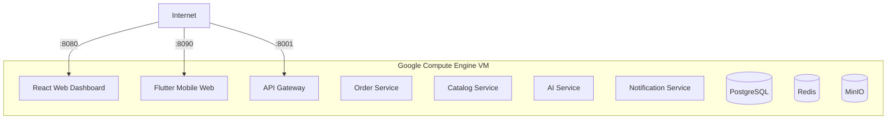
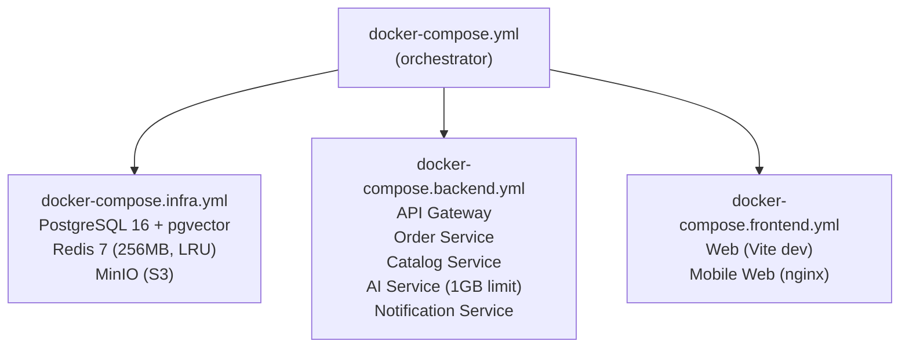

# Deployment Guide — comstruct C-Materials Platform

---

## Local Development (Docker Compose)

### Prerequisites

- Docker Desktop (with Docker Compose v2)
- Node.js 20+ and pnpm (for web app dev)
- Flutter 3+ (for mobile app dev)
- OpenSSL (for JWT key generation)

### Quick Start

```bash
# 1. Clone
git clone https://github.com/BlackSamuron0305/Comstruct-Challenge-Think-Codex-Hackathon.git
cd Comstruct-Challenge-Think-Codex-Hackathon

# 2. Configure
cp .env.example .env       # Fill in API keys (OPENAI_API_KEY, etc.)

# 3. Generate JWT keypair + start stack
make gen-keys
make up                    # docker compose up --build -d

# 4. Run migrations + seed demo data
make migrate               # alembic upgrade head on order + catalog
make seed                  # demo users + sample C-materials
```

### Service URLs (Local)

| Service | URL |
|---------|-----|
| Web dashboard | http://localhost:8080 |
| Mobile web | http://localhost:8090 |
| API gateway | http://localhost:8001 |
| Order service | http://localhost:8002 |
| Catalog service | http://localhost:8003 |
| Notification service | http://localhost:8004 |
| AI service | http://localhost:8005 |
| MinIO console | http://localhost:9001 |
| PostgreSQL | `localhost:5432` |
| Redis | `localhost:6379` |

### Demo Accounts (after `make seed`)

| Role | Email | Password |
|------|-------|----------|
| Foreman | `foreman@brueckesg.ch` | `comstruct-demo` |
| Project Manager | `pm@brueckesg.ch` | `comstruct-demo` |
| Procurement Admin | `procurement@comstruct.com` | `comstruct-demo` |

---

## GCE VM Deployment (Hackathon)

### Architecture



### First-Time Setup

1. **Create Ubuntu VM** in Google Cloud Compute Engine
2. **Install Docker** and the Docker Compose plugin
3. **Open firewall ports**: 8001, 8080, 8090
4. **Clone repo** onto the VM

```bash
git clone https://github.com/BlackSamuron0305/Comstruct-Challenge-Think-Codex-Hackathon.git
cd Comstruct-Challenge-Think-Codex-Hackathon
```

5. **Configure `.env`** for public access:

```env
VITE_API_BASE_URL=http://YOUR_VM_IP:8001/api
VITE_WS_URL=ws://YOUR_VM_IP:8001/ws
FLUTTER_API_BASE_URL=http://YOUR_VM_IP:8001/api
FLUTTER_WS_URL=ws://YOUR_VM_IP:8001/ws
CORS_ORIGIN=http://YOUR_VM_IP:8080,http://YOUR_VM_IP:8090,http://localhost:8080,http://127.0.0.1:8080
```

6. **Deploy:**

```bash
make deploy-init
```

### Update Deployed Stack

```bash
make deploy-update
```

This will:
- Ensure `.env` exists
- Generate JWT keys if missing
- `git pull --ff-only`
- Rebuild and restart the Docker Compose stack

### Deployment Helpers

```bash
make deploy-status   # Show running containers
make deploy-logs     # Tail all service logs
```

### Mobile Web (Flutter)

To expose the Flutter foreman app in a browser:

```bash
# On a machine with Flutter installed:
./scripts/deploy-mobile-web.sh build http://YOUR_VM_IP:8001

# Then publish via Docker Compose:
./scripts/deploy-mobile-web.sh publish
```

First-time Flutter web setup:
```bash
cd apps/mobile
flutter create --platforms=web .
```

---

## Environment Variables Reference

### Database

| Variable | Default | Description |
|----------|---------|-------------|
| `POSTGRES_HOST` | `postgres` | PostgreSQL hostname |
| `POSTGRES_PORT` | `5432` | PostgreSQL port |
| `POSTGRES_DB` | `comstruct` | Database name |
| `POSTGRES_USER` | `comstruct_app` | Database user |
| `POSTGRES_PASSWORD` | — | Database password |
| `DATABASE_URL` | — | Async connection string (SQLAlchemy) |
| `SYNC_DATABASE_URL` | — | Sync connection string (Alembic) |

### Redis

| Variable | Default | Description |
|----------|---------|-------------|
| `REDIS_PASSWORD` | — | Redis auth password |
| `REDIS_URL` | — | Full Redis connection URL |

### JWT

| Variable | Default | Description |
|----------|---------|-------------|
| `JWT_PRIVATE_KEY_PATH` | `/run/secrets/jwt_private.pem` | RS256 private key path |
| `JWT_PUBLIC_KEY_PATH` | `/run/secrets/jwt_public.pem` | RS256 public key path |
| `JWT_ALGORITHM` | `RS256` | JWT signing algorithm |
| `JWT_ACCESS_TOKEN_EXPIRE_MINUTES` | `60` | Access token TTL |
| `JWT_REFRESH_TOKEN_EXPIRE_DAYS` | `30` | Refresh token TTL |

### AI / LLM

| Variable | Default | Description |
|----------|---------|-------------|
| `LLM_PROVIDER` | `openai` | LLM backend: `openai`, `anthropic`, `ollama` |
| `OPENAI_API_KEY` | — | OpenAI API key |
| `OPENAI_MODEL` | `gpt-4.1-mini` | Chat/reasoning model |
| `OPENAI_VISION_MODEL` | `gpt-4.1-mini` | Vision/image analysis model |
| `OPENAI_AUDIO_MODEL` | `gpt-4o-mini-transcribe` | Audio transcription model |
| `OPENAI_EMBED_MODEL` | `text-embedding-3-small` | Embedding model |
| `ANTHROPIC_API_KEY` | — | Anthropic API key |
| `ANTHROPIC_MODEL` | `claude-sonnet-4-5-20250514` | Claude model |
| `OLLAMA_BASE_URL` | `http://host.docker.internal:11434` | Ollama endpoint |

### S3 / MinIO

| Variable | Default | Description |
|----------|---------|-------------|
| `S3_ENDPOINT` | `http://minio:9000` | MinIO endpoint |
| `S3_PUBLIC_ENDPOINT` | `http://localhost:9000` | Public MinIO URL |
| `S3_BUCKET` | `comstruct-contracts` | Default bucket |
| `S3_ACCESS_KEY` | — | MinIO access key |
| `S3_SECRET_KEY` | — | MinIO secret key |

### Frontend

| Variable | Default | Description |
|----------|---------|-------------|
| `VITE_API_BASE_URL` | `http://127.0.0.1:8001/api` | Web app API base |
| `VITE_WS_URL` | `ws://127.0.0.1:8001/ws` | Web app WebSocket URL |
| `FLUTTER_API_BASE_URL` | — | Mobile app API base |
| `FLUTTER_WS_URL` | — | Mobile app WebSocket URL |
| `CORS_ORIGIN` | — | Comma-separated allowed origins |

### Notifications

| Variable | Default | Description |
|----------|---------|-------------|
| `RESEND_API_KEY` | — | Resend email API key |
| `FROM_EMAIL` | `noreply@comstruct.local` | Sender email address |
| `FIREBASE_SERVICE_ACCOUNT_JSON` | — | Firebase service account path |
| `APNS_KEY_PATH` | — | Apple push notification key |

### Application

| Variable | Default | Description |
|----------|---------|-------------|
| `DEFAULT_APPROVAL_THRESHOLD` | `200.00` | Auto-approve amount (CHF) |
| `DEFAULT_CURRENCY` | `CHF` | Default currency |
| `RATE_LIMIT_PER_MINUTE` | `100` | API rate limit |
| `REQUEST_TIMEOUT_MS` | `30000` | Request timeout |
| `LOG_LEVEL` | `info` | Logging level |
| `AUDIT_LOG_ENABLED` | `true` | Enable audit logging |

---

## Docker Compose Files



### Key Configuration Details

- **PostgreSQL**: Health check every 10s, pgvector + uuid-ossp + pg_trgm extensions
- **Redis**: 256MB max memory, LRU eviction, FLUSHALL/DEBUG commands disabled
- **MinIO**: Auto-creates `comstruct-contracts` bucket
- **AI Service**: 1GB memory limit
- **All services**: Health checks, restart policies, depends_on with health conditions

---

## Make Commands Reference

| Command | Description |
|---------|-------------|
| `make up` | Build and start the full Docker stack |
| `make down` | Stop stack and remove volumes |
| `make restart` | Restart all containers |
| `make logs` | Tail all service logs |
| `make ps` | List running containers |
| `make gen-keys` | Generate RS256 JWT keypair |
| `make migrate` | Run Alembic migrations (order + catalog) |
| `make seed` | Seed demo users + sample products |
| `make test` | Run all test suites |
| `make lint` | Run linters (ruff + eslint) |
| `make clean` | Full cleanup (volumes, node_modules, caches) |
| `make deploy-init` | First-time VM deploy |
| `make deploy-update` | Update deployed stack |
| `make deploy-logs` | Tail deployed stack logs |
| `make deploy-status` | Show deployed container status |
| `make mobile-web-build` | Build Flutter web bundle |
| `make mobile-web-publish` | Publish Flutter web on :8090 |
