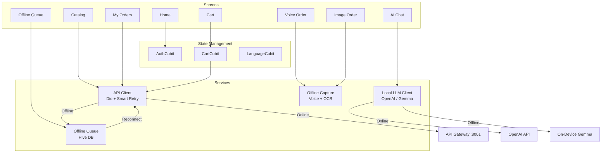
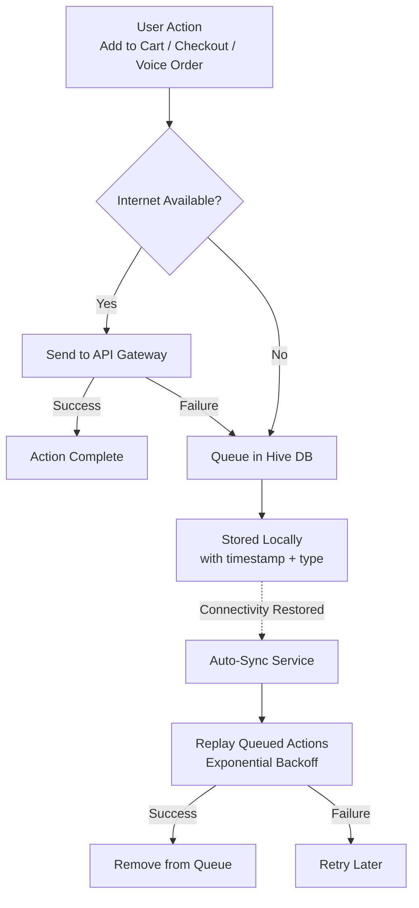
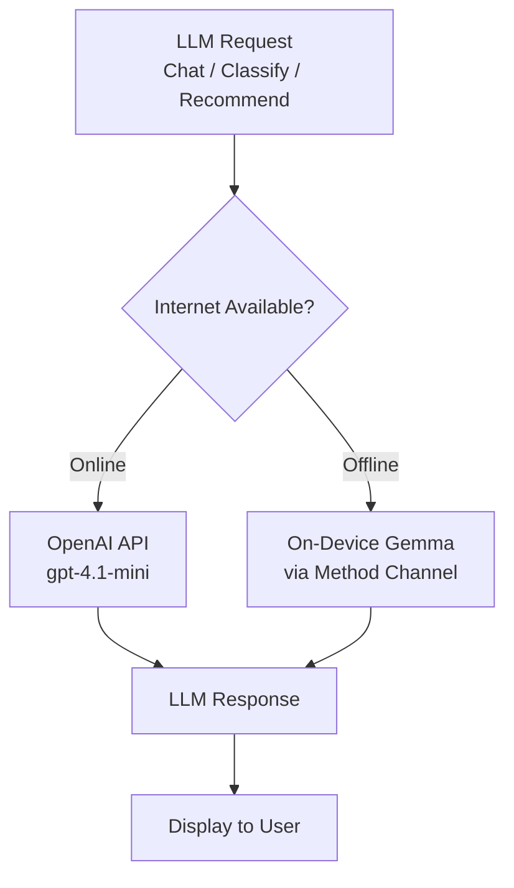
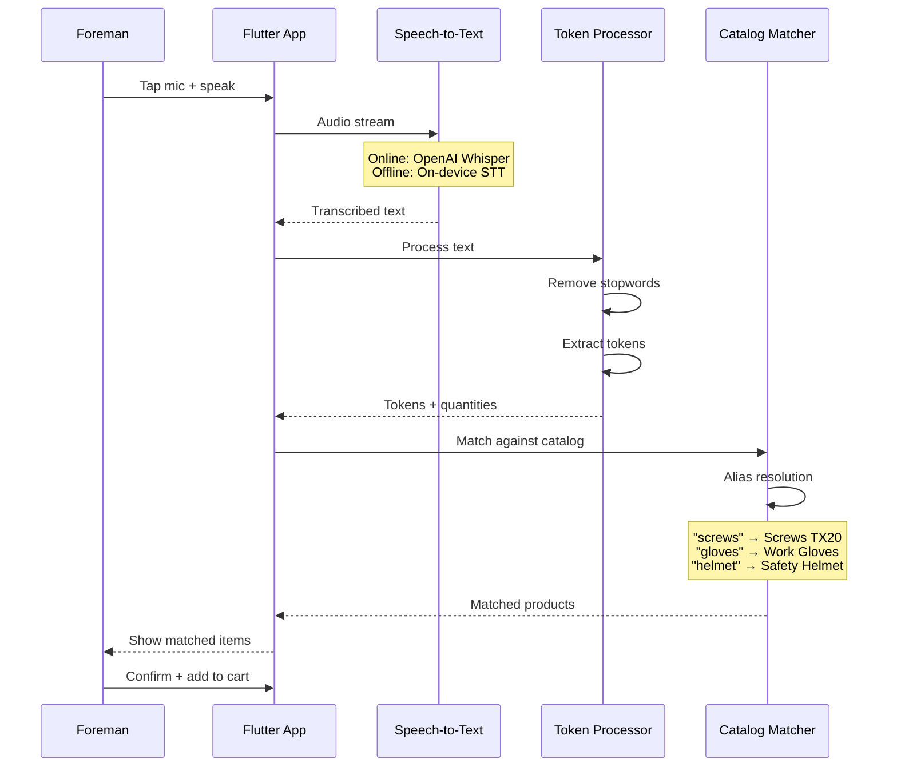
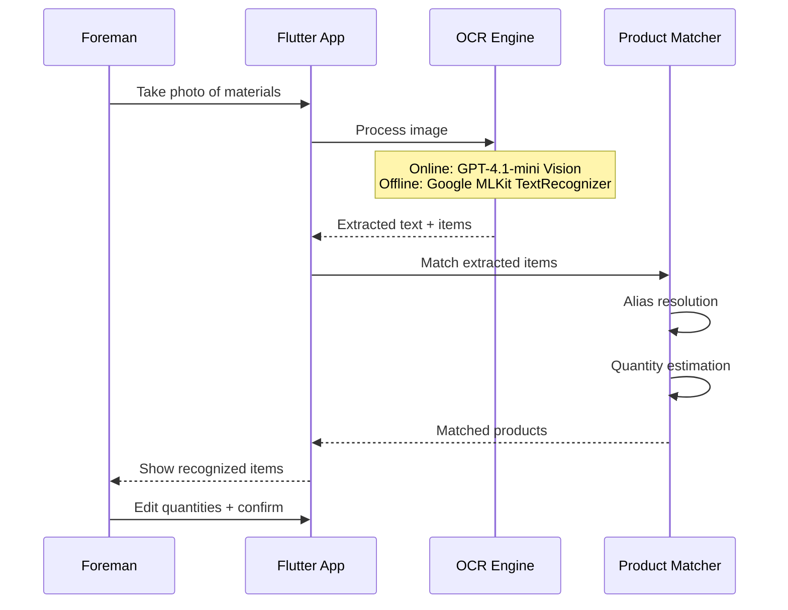
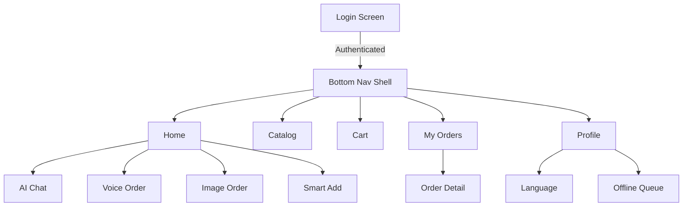

# Mobile App — comstruct C-Materials Platform

**Flutter 3 · Dart · BLoC (Cubit) · Hive · Google MLKit · Dio**

The mobile app is designed for **foremen on construction sites** — ordering C-materials with voice, camera, and text, even without internet connectivity.

---

## Screens

| Screen | File | Purpose |
|--------|------|---------|
| Login | `login_screen.dart` | Email/password authentication |
| Home | `c_home_screen.dart` | Dashboard with quick actions |
| Catalog | `c_catalog_screen.dart` | Browse products by category |
| Cart | `cart_screen.dart` | Review and checkout |
| Chat | `chat_screen.dart` | AI construction assistant |
| Voice Order | `voice_order_screen.dart` | Voice-based material ordering |
| Image Order | `image_order_screen.dart` | Photo/OCR-based ordering |
| Smart Add | `smart_add_screen.dart` | AI-powered quick add |
| Favorites | `favorites_screen.dart` | Saved favourite products |
| My Orders | `my_orders_screen.dart` | Order history and status |
| Order Detail | `order_detail_screen.dart` | Full order detail view |
| Offline Queue | `offline_queue_screen.dart` | Queued orders (no connectivity) |
| Projects | `projects_screen.dart` | Project selection |
| Profile | `profile_screen.dart` | User profile (trade, language, glove size) |
| Language | `language_screen.dart` | Language preference |

---

## Architecture

---

## Offline-First Architecture

The app is designed to work without internet connectivity, queuing actions for replay when online.

### Queue Item Types

| Type | Description |
|------|-------------|
| `checkout` | Full cart checkout |
| `add_to_cart` | Add product to cart |
| `voice_order` | Voice-captured order |
| `image_order` | Photo/OCR-captured order |

### Storage

- **Hive** — Local key-value database for queue persistence
- **flutter_secure_storage** — JWT tokens stored securely
- **Connectivity detection** — `connectivity_plus` package monitors network state

---

## Hybrid LLM (Online + Offline)

| Mode | Provider | Capabilities |
|------|----------|-------------|
| **Online** | OpenAI (gpt-4.1-mini) | Full chat, vision, recommendations, streaming |
| **Offline** | On-device Gemma (Method Channel) | Basic chat, classification, JSON generation |

The `LocalLlmClient` handles provider selection transparently. Fallback is graceful — the UI adapts to available capabilities.

---

## Voice Ordering

### Catalog Aliases

| Spoken Word | Resolves To |
|-------------|-------------|
| screws | Screws TX20 |
| anchors | Anchor Bolts |
| gloves | Work Gloves |
| masks | FFP2 Masks |
| goggles | Safety Goggles |
| helmet | Safety Helmet |
| tape | Duct Tape / Insulation Tape |
| foam | PU Foam |
| drill | Drill Bits |
| battery | Batteries |
| bags | Waste Bags |
| marker | Construction Markers |
| ties | Cable Ties |

---

## Image/OCR Ordering

**Use cases:**
- Photograph a shelf with low supplies → app identifies needed items
- Scan a supplier delivery note → extract product names and quantities
- Photo of a handwritten materials list → OCR + matching

---

## API Client

Built on **Dio** with production-grade features:

| Feature | Implementation |
|---------|---------------|
| **Auto-retry** | `dio_smart_retry` with exponential backoff |
| **Token refresh** | Auto-refresh on 401 responses |
| **Secure storage** | JWT tokens in `flutter_secure_storage` |
| **Offline cache** | Hive-backed response cache |
| **Currency parsing** | CHF/EUR normalization for flexible number formats |
| **Error handling** | Descriptive error messages per `DioException` type |

### Multi-Host Reachability

The API client checks multiple potential hosts on startup:
1. Configured `FLUTTER_API_BASE_URL` from environment
2. `localhost` fallback for development
3. LAN IP for local network testing

---

## Navigation

**GoRouter** with auth-gated routes and bottom navigation shell:

---

## Worker Profile

The app stores foreman-specific profile data:

| Field | Purpose |
|-------|---------|
| `trade` | Construction trade (e.g., electrician, plumber, general) |
| `language` | Preferred language for AI responses |
| `glove_size` | PPE sizing for auto-suggestions |
| `device_token` | FCM token for push notifications |
| `offline_model_version` | On-device LLM model version |
