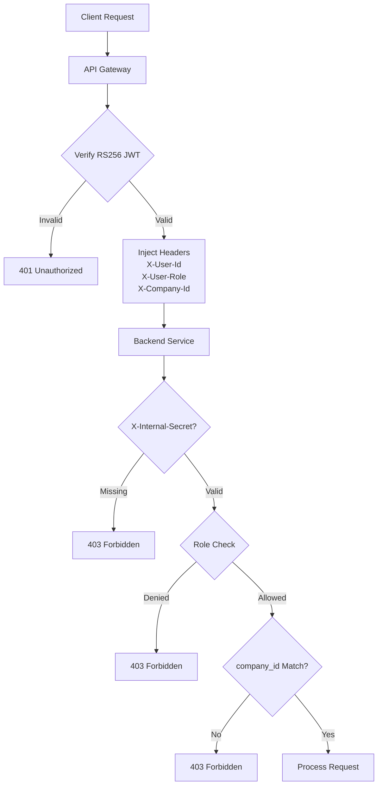
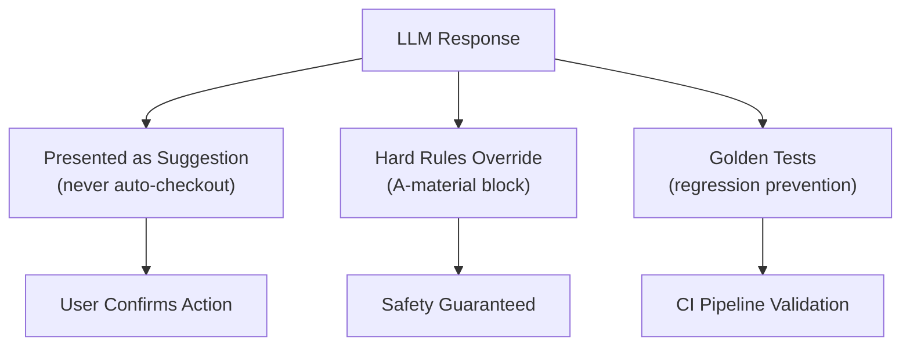

# Security & Compliance — comstruct C-Materials Platform

> Hackathon-grade compliance posture. Production deployment requires a full DPIA, contract review with sub-processors, and security audit.

---

## Data Classification

| Class | Examples | Where Stored |
|-------|---------|--------------|
| Personal | User name, email, role, FCM device token | `auth.users` (PostgreSQL, EU region) |
| Operational | Orders, line items, delivery addresses, project sites | `orders.*` (PostgreSQL) |
| Catalog | Supplier products, prices, embeddings | `catalog.*` (PostgreSQL + pgvector) |
| Documents | Supplier PDFs/CSVs uploaded for ingestion | MinIO/S3 bucket |
| Logs | Audit trail of approvals, status transitions | `audit.audit_log` |

No special-category personal data (GDPR Art. 9) is processed.

---

## GDPR — Lawful Basis & Rights

- **Lawful basis**: Art. 6(1)(b) contract — the platform is the tool the customer uses to operate procurement
- **Data subject rights**: Handled via customer-admin role. `DELETE /api/users/{id}` performs soft-delete and anonymises the audit trail (`actor_email → "deleted-user-<id8>"`)
- **Data export**: `GET /api/users/{id}/export` returns JSON of all user's orders + comments
- **Retention**: Orders and audit log retained 10 years per Swiss `OR Art. 958f` accounting law. Uploaded supplier docs retained 90 days then purged

---

## Sub-Processors

| Service | Purpose | Region | DPA |
|---------|---------|--------|-----|
| Ollama (local) | LLM inference (gemma3:4b) | On-premise | No external data transfer |
| OpenAI | Chat, vision, embeddings | US | OpenAI DPA |
| Resend | Transactional email | EU | DPA on file |
| Firebase FCM | Push notifications | US | Google Cloud DPA |

**Data minimisation at LLM boundary**: The AI service sends only product names/categories/prices and the foreman's free-text task description — never user email, project address, or supplier contact details.

---

## OWASP Top 10 Mapping

| # | Category | Status | Implementation |
|---|----------|--------|----------------|
| A01 | Broken Access Control | ✅ Mitigated | RBAC per service, company_id isolation, project ownership checks, `X-Internal-Secret` gateway boundary |
| A02 | Cryptographic Failures | ✅ Mitigated | RS256 JWT (asymmetric), bcrypt cost-12 passwords, secrets via env vars |
| A03 | Injection | ✅ Mitigated | SQLAlchemy ORM (parameterised queries), Pydantic/Zod input validation |
| A04 | Insecure Design | ✅ Mitigated | Defense-in-depth: gateway auth + per-service secret + role checks, A-material hard block |
| A05 | Security Misconfiguration | ✅ Mitigated | Security headers on all services, Helmet on gateway, restrictive CORS, TrustedHostMiddleware |
| A06 | Vulnerable Components | ⚠️ Partial | Pinned base images (Python 3.12-slim, Node 20-alpine); production needs Dependabot/Snyk |
| A07 | Auth Failures | ✅ Mitigated | Min-8 password login, rate-limited auth endpoints (10/min), WebSocket message-based auth |
| A08 | Data Integrity Failures | ✅ Mitigated | Append-only audit log, state machine enforcing valid transitions |
| A09 | Logging & Monitoring | ✅ Mitigated | Structured audit middleware on all Python services, correlation via `x-user-id` |
| A10 | SSRF | ✅ Mitigated | Internal services only reachable via Docker network, no user-controlled URLs in backend calls |

---

## Security Controls

### Authentication & Authorization

| Control | Implementation |
|---------|---------------|
| **JWT** | RS256 asymmetric (60-min access + 30-day rotating refresh) |
| **Password** | bcrypt cost-12 via passlib |
| **Internal boundary** | `X-Internal-Secret` header between gateway and services |
| **RBAC** | Per-endpoint role enforcement (construction_worker, foreman, procurement_worker) |
| **Company isolation** | All queries scoped by `company_id` from JWT — cross-company blocked |
| **Rate limiting** | 200 req/min global, 10 req/min on auth endpoints |
| **WebSocket auth** | Message-based JWT with 10-second timeout |

### Transport & Infrastructure

| Control | Implementation |
|---------|---------------|
| **Security headers** | `X-Content-Type-Options: nosniff`, `X-Frame-Options: DENY`, `Referrer-Policy: strict-origin-when-cross-origin`, CSP + HSTS via Helmet |
| **CORS** | Whitelist of allowed origins |
| **Container hardening** | All Docker containers run as non-root `appuser` (UID 1000) |
| **Body size limit** | Configurable max request body (default 10MB) |
| **Error sanitisation** | Internal details (UUIDs, stack traces) never returned to clients |
| **Input validation** | Pydantic (Python) + Zod (TypeScript) at every boundary; query params bounded (`limit ≤ 200`, `offset ≥ 0`) |

### Data Protection

| Control | Implementation |
|---------|---------------|
| **Audit log** | Append-only `audit.audit_log` — every order mutation recorded |
| **State machine** | Strict transition enforcement prevents invalid order state changes |
| **Cart atomicity** | Redis Lua scripts prevent race conditions |
| **Secrets** | `.env` is git-ignored; production uses vault-based secret management |
| **Parameterised queries** | SQLAlchemy ORM prevents SQL injection |

---

## AI Governance

| Principle | Implementation |
|-----------|---------------|
| **Suggestions only** | LLM responses never auto-checkout. User explicitly taps "Add to cart" |
| **Hard rule override** | ABC classifier enforces price > 500 CHF and structural keywords → always A-material, regardless of LLM output |
| **Deterministic fallback** | Platform degrades gracefully if LLM is unavailable — price/category heuristics |
| **Golden tests** | `test_classifier_golden.py` locks regression cases to prevent prompt drift |
| **Data minimisation** | LLM sees only product names/categories/prices — never PII, addresses, or contact details |
| **Local inference** | Ollama option ensures zero data leaves infrastructure |

---

## Audit & Monitoring

| Aspect | Implementation |
|--------|---------------|
| **Audit log** | `audit.audit_log` is append-only with `actor_id`, `actor_role`, timestamp |
| **Structured logging** | Middleware logs method, path, user, status, duration for all mutating requests |
| **Correlation** | `x-user-id` header propagated across services |
| **WebSocket** | Read-only events; channel cannot mutate state |
| **Sentry** | DSN configurable for error tracking (production) |

---

## Open Items for Production

- [ ] Penetration test
- [ ] Disaster-recovery runbook & quarterly restore drill
- [ ] Sub-processor DPA signatures
- [ ] DPIA for AI processing
- [ ] Token revocation / blacklist (Redis-backed)
- [ ] MFA for procurement-admin and project-manager roles
- [ ] Request correlation IDs across service boundaries
- [ ] Database encryption at rest
- [ ] Dependency vulnerability scanning (Snyk/Dependabot CI integration)
- [ ] TLS termination (Caddy/Traefik in production)
- [ ] Network policies for service mesh isolation
